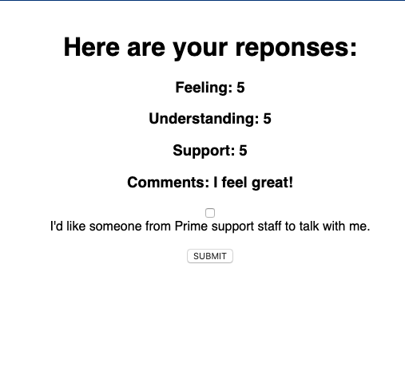

# Redux Feedback Loop

Redux Feedback Loop is a survey that can be used by a school or workplace to gather information from the user and store it in a database. 
## Description
Duration: ~10 hours

Using radio buttons and an input section, the user gives a ranking from 1-5 on how they feel, how well they understand the material and how supported they feel by staff. There is also a text input field for additional comments, as well as a button that can flag the entry if the person wants to discuss further with a staff member. The user cannot move to another screen if the input is left blank, and upon completion of the survey they are taken back to the home screen. 

### Screenshot

### Prerequisites

Node.js

The queries in the database.sql file are set up to create all the necessary tables and populate the needed data to allow the application to run correctly. The project is built on Postgres, so you will need to make sure to have that installed. We recommend using Postico to run those queries as that was used to create the queries. Copy the code text from database.sql into Postico to create the database.

Open your editor of choice and run npm install.
Type npm run server in the terminal to start the server and npm run client in another to run the client. 
Go to localhost:5000 in your browser to view the homepage.

### Usage 

The website is fairly straightforward, simply follow the prompts on the screen.

### Acknowledgement

Thanks to Prime Digital Academy in Minneapolis who equipped and helped me to make this application

### Support

If you have any further questions please email me at pedemaio@gmail.com
